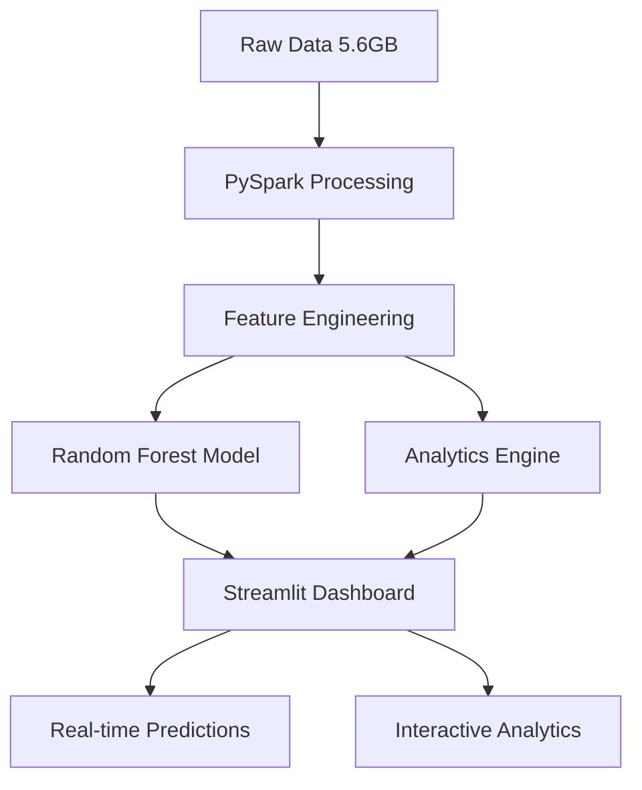
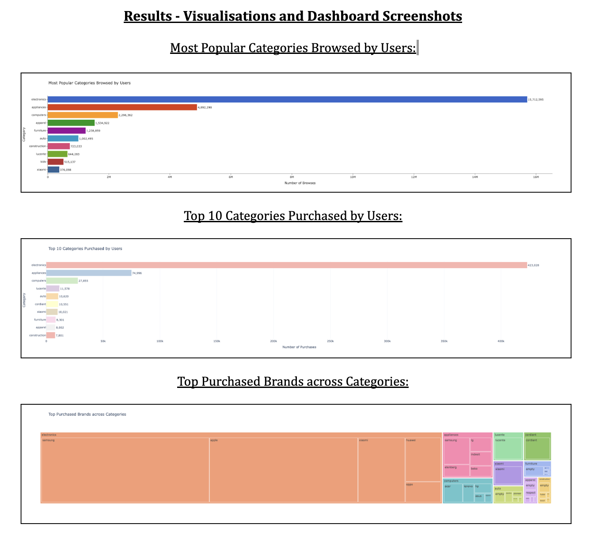
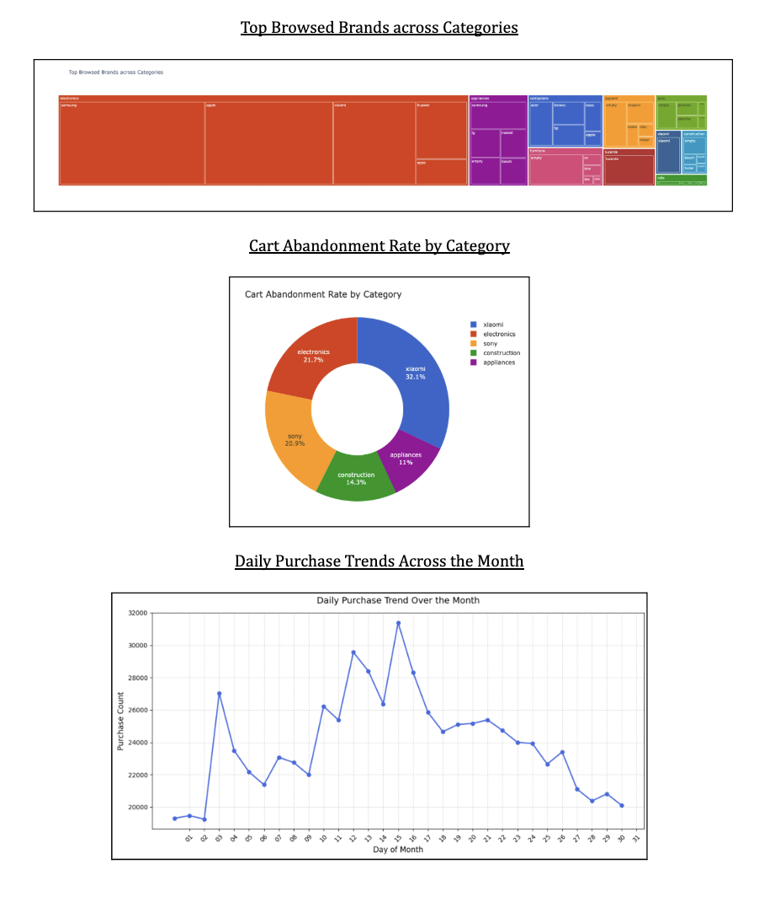

# 🛒 E-commerce Clickstream Analytics & Purchase Prediction

[](https://www.python.org/downloads/)
[](https://spark.apache.org/)
[](https://streamlit.io/)
[](LICENSE)

> **Big Data Analytics Project**: Analyzing e-commerce user behavior and predicting purchase likelihood using machine learning on large-scale clickstream data.

## 📊 Project Overview

This project leverages **big data technologies** and **machine learning** to analyze e-commerce user behavior patterns and predict purchase likelihood from a massive clickstream dataset. Built with **PySpark** for distributed computing and **Streamlit** for interactive visualization.

### 🎯 Key Objectives

- 📈 **Analyze** product category and brand performance
- 🛒 **Evaluate** cart abandonment behavior patterns  
- ⏰ **Identify** temporal shopping trends and peak hours
- 🤖 **Build** ML classification model for purchase prediction
- 📱 **Develop** interactive dashboard for real-time insights
 
## 🏗️ Architecture & Technologies 

<div align="center">



</div>

### 🛠️ Tech Stack

| Component | Technology | Purpose |
|-----------|------------|---------|
| **Data Processing** | PySpark 3.5.1 | Distributed computing for large datasets |
| **Machine Learning** | Spark MLlib | Classification model training |
| **Web Framework** | Streamlit | Interactive dashboard |
| **Visualization** | Plotly, Matplotlib | Charts and graphs |
| **Data Analysis** | Pandas, NumPy | Data manipulation |
| **Environment** | Python 3.8+ | Core runtime |

## 📁 Project Structure

```
SP25-CS-GY-6513-Team-14/
├── 📱 app.py                          # Streamlit Dashboard Application
├── 📊 Notebook/
│   ├── Big_Data_Analytics.ipynb       # Main Analytics Notebook
│   └── Training(1).ipynb              # ML Model Training
├── 🖼️ imgs/                           # Results & Screenshots
│   ├── results_1.png
│   └── results_2.png
├── 🤖 RF_model/                       # Trained Random Forest Model
│   ├── data/
│   ├── metadata/
│   └── treesMetadata/
├── 📋 requirements.txt                # Python Dependencies
├── 📄 data_without_purchase_event.csv # Processed Dataset
└── 📂 extras/                         # Additional Scripts & Data
```

## 🚀 Quick Start

### 🔧 Environment Setup

1. **Install ASDF** (if not already installed)
   ```bash
   # Follow installation guide: https://asdf-vm.com/guide/getting-started.html
   ```

2. **Install Required Plugins**
   ```bash
   asdf plugin add python
   asdf plugin add java
   ```

3. **Install Runtime Versions**
   ```bash
   asdf install
   ```

4. **Install Python Dependencies**
   ```bash
   pip install -r requirements.txt
   ```

### 🏃‍♂️ Running the Application

1. **Launch Streamlit Dashboard**
   ```bash
   streamlit run app.py
   ```

2. **Access the Dashboard**
   - Open your browser to `http://localhost:8501`
   - Navigate between **Predictions** and **Analytics** tabs

## 📊 Key Features & Insights

### 🎯 Purchase Prediction Model
- **Algorithm**: Random Forest Classifier
- **Features**: User behavior, product categories, temporal patterns
- **Performance**: Optimized for real-time predictions
- **Deployment**: Integrated Streamlit interface

### 📈 Analytics Dashboard

#### 🏆 Top Performing Categories
| Rank | Category | Browse Count | Purchase Count |
|------|----------|--------------|----------------|
| 1 | Electronics | 15.7M | 423K |
| 2 | Appliances | 4.9M | 75K |
| 3 | Computers | 2.3M | 28K |

#### 🛒 Cart Abandonment Analysis
- **Electronics**: 37.3% abandonment rate
- **Xiaomi**: 54.9% abandonment rate  
- **Sony**: 35.7% abandonment rate

#### ⏰ Peak Shopping Hours
- **Prime Time**: 16:00 (4 PM)
- **Recommendation**: Flash sales 13:00-16:00 for maximum impact

## 📸 Visual Results

### 📹 Live Demo of App

[](https://github.com/user-attachments/assets/b1a8bb3c-0824-445e-9189-e1cc9af2ff7a)

*Interactive demonstration of the Streamlit dashboard with real-time predictions and analytics*

### 🎨 Some Results

<table>
<tr>
<td width="50%">



</td>
<td width="50%">



</td>
</tr>
</table>

## 📈 Key Findings

### 🏪 Product Performance
- **Top Category**: Electronics dominates with 15.7M browses and 423K purchases
- **Conversion Leader**: Notebooks show highest cart-to-purchase conversion
- **Brand Insights**: Samsung leads electronics browsing, Apple follows closely

### 🛒 Shopping Behavior
- **Peak Activity**: 16:00 shows maximum user engagement
- **Temporal Trends**: Mid-month (days 11-16) see highest purchase intent
- **Cart Abandonment**: Varies significantly by category (18.8% - 54.9%)

### 💡 Business Recommendations
1. **Flash Sales**: Target 13:00-16:00 for maximum impact
2. **Mid-Month Promotions**: Capitalize on days 11-16 purchase peaks  
3. **Category Focus**: Prioritize electronics and appliances inventory
4. **Abandonment Recovery**: Implement targeted campaigns for high-abandonment categories

## 🔬 Technical Implementation

### 🧠 Machine Learning Pipeline

```python
# Feature Engineering Pipeline
categotyIdxer = StringIndexer(inputCol='category', outputCol='category_idx')
event_typeIdxer = StringIndexer(inputCol='event_type', outputCol='event_type_idx')
brandIdxer = StringIndexer(inputCol='brand', outputCol='brand_idx')

# One-Hot Encoding
one_hot_encoder_category = OneHotEncoder(inputCol="category_idx", outputCol="category_vec")

# Vector Assembly
assembler = VectorAssembler(inputCols=["features_cat", "features_num"], outputCol="features")

# Random Forest Model
rf = RandomForestClassifier(featuresCol="features", labelCol="label")
```

### 📊 Data Processing Highlights

- **Dataset Size**: 5.6GB (scalable to 60GB yearly)
- **Records Processed**: 42M+ clickstream events
- **Unique Visitors**: 3M+ in October 2019
- **Processing Engine**: PySpark distributed computing

## 🎯 Usage Examples

### 🔮 Making Predictions

```python
# Load your data
df = spark.read.option("header", "true").csv("your_data.csv")

# Apply preprocessing pipeline
df_transformed = pipeline.fit(features).transform(features)

# Generate predictions
predictions = model.transform(df_transformed)

# Get user-level predictions
user_predictions = predictions.select(
    "user_id",
    when(col("prediction") == 1, "Will Purchase").otherwise("Won't Purchase").alias("prediction")
)
```

### 📊 Analytics Queries

```python
# Top categories by purchase count
top_categories = df_purchase.groupBy("category").count().orderBy(desc("count"))

# Cart abandonment rate calculation
cart_abandonment = cart_purchase_df.withColumn(
    "abandonment_rate", 
    (1 - col("purchase_count") / col("cart_count")) * 100
)
```

## 📂 Data Source

**Original Dataset**: [E-commerce Behavior Data](https://www.kaggle.com/datasets/mkechinov/ecommerce-behavior-data-from-multi-category-store)
- **Provider**: REES46 for eCommerce
- **Size**: 5.6GB clickstream data
- **Period**: October 2019
- **Events**: View, Cart, Purchase

## 🚧 Challenges & Solutions

| Challenge | Solution |
|-----------|----------|
| **Memory Issues** | Adopted PySpark for distributed processing |
| **Missing Data** | Implemented UDFs with fallback strategies |
| **Performance** | Used Spark's lazy evaluation and caching |
| **Visualization** | Aggregated data before plotting |
| **Deployment** | Streamlit for interactive dashboard |

## 🔮 Future Enhancements

### 🎯 Planned Features
- [ ] **User Segmentation**: K-means clustering for behavior analysis
- [ ] **Real-time Analytics**: Kafka + Spark Streaming integration
- [ ] **Sequential Mining**: PrefixSpan for navigation pattern analysis
- [ ] **Advanced ML**: XGBoost and deep learning models
- [ ] **Geographic Analysis**: Location-based insights

### 📊 Advanced Analytics
- **Cohort Analysis**: User retention tracking
- **A/B Testing**: Feature impact measurement
- **Recommendation Engine**: Collaborative filtering
- **Anomaly Detection**: Fraud and bot detection


